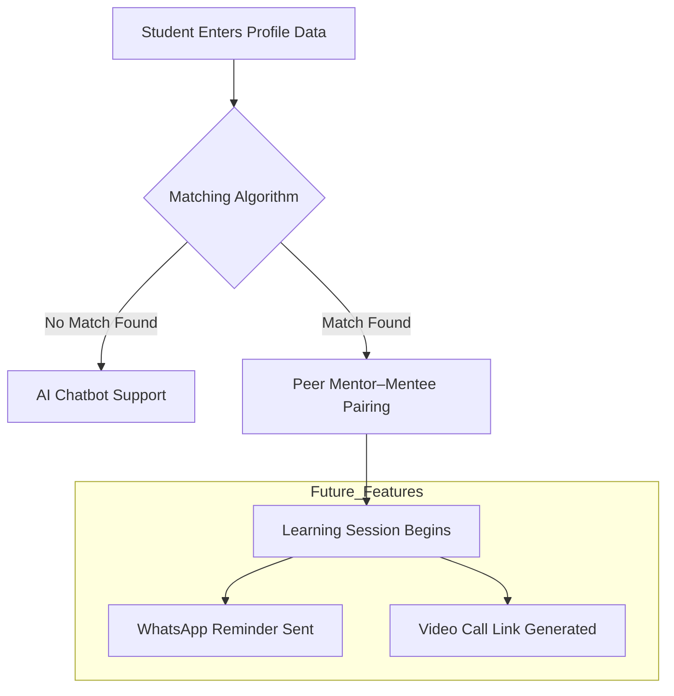

# Sahay – Peer Learning Matchmaking System 🎓🤝

**Sahay** is an adaptive peer-learning platform designed to bridge educational gaps for NGO and college students by intelligently pairing learners based on subject strengths, weaknesses, academic year, and availability.

---

## 🚩 Problem Statement
NGO students face multiple challenges that hinder effective learning:

- **High Student–Teacher Ratio:** Many NGOs operate with ratios as high as 1:40, making personalized attention difficult.
- **Limited Resources:** Students come from diverse academic backgrounds; traditional one-size-fits-all teaching often leaves many behind.
- **Low Digital Literacy:** Nearly **60–80% of rural students** struggle with digital learning tools, widening learning gaps.

These challenges result in uneven learning outcomes and reduced student confidence.

---

## 💡 Our Solution
**Sahay** enables structured and supportive **peer-to-peer learning** by leveraging student strengths within the same learning community.

### Key Solution Highlights
- **Skill-Based Matching:** Students specify subjects they are strong in and where they need help.
- **Rubric-Based Algorithm:** A compatibility score identifies the best mentor–mentee pairs.
- **Adaptive Motivation:** Mentors earn **credits, badges, and recognition** after successful sessions.
- **Support Escalation:** AI assistance and faculty support are available when peers cannot resolve doubts.

---

## ⚙️ How It Works (Solution Flow)



## 🎮 Core Features
- Role-based onboarding (**Student / Teacher**)
- Academic year classification (FY, SY, TY, Fourth Year)
- Strength–weakness-based mentor–mentee matching
- Gamified matchmaking experience
- Learning session interface:
  - Chat (prototype)
  - File sharing (PDFs, images, links)
  - AI helper (prototype)
- Faculty escalation option
- Mentor rating, credits, and badge system
- Session-based mentor leaderboard

---

## 🛠️ Tech Stack
- **Python**
- **Streamlit**
- **GitHub** (Version Control)
- **Streamlit Community Cloud** (Deployment)

---

## 🚀 Running the Project Locally
```bash
pip install streamlit
streamlit run app.py

##🌐 Live Demo

🔗 Streamlit Community Cloud Deployment
https://adaptivelearningngo-ctc-thesemicolon.streamlit.app/

##🔮 Future Scope

Real-time chat and video calling (WebRTC integration)
AI-powered doubt resolution
Persistent database integration
Mentor analytics and performance tracking
WhatsApp/SMS reminders for learning sessions
Support for vocational and skill-based learning

##👥 Team Details

Team Name: The Semicolon

Project Name: Sahay – Peer Learning Matching System

👩‍💻 Team Leader
Srushti Kalokhe

👩‍💻 Team Members
Srushti Kalokhe
Swarali Warade
Nikita Sharma
Tanieeshka Sonawane
Anushka Dhane

##🏆 Hackathon Note
This project is a functional prototype developed during a hackathon.
The focus is on demonstrating logic, user flow, and scalability, with advanced features planned for future development.


